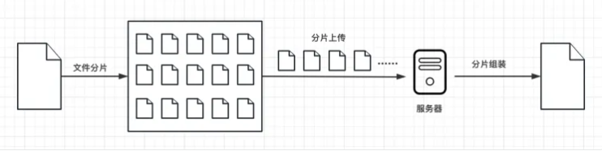

# 大文件上传
## 问题
1. 需要很长时间
2. 一旦出错需要重新上传
3. 服务端对文件大小有限制
   
## 解决
> 分片上传
> 原理：把一个大蛋糕 🎂 切成小块 🍰 一样。首先，我们将要上传的大文件分成许多小块，每个小块大小相等（1MB），然后逐个上传这些小块到服务器。上传的时候，可以同时上传多个小块，也可以一个一个上传。上传每个小块后，服务器会保存这些小块，并记录它们的顺序和位置信息。


## 好处
1. 减小上传失败的风险 ➡️ 上传中出了问题，只需要重新上传出错的小块
2. 加快上传速度 ➡️ 可以同时上传多个小块，充分利用网络带宽

## 实现
### 1. 搭建
* client：vue3+vite
* server：express框架｜工具包（`multiparty`、`fs-extra`、`cors`、`body-parser`、`nodemon`）
### 2. 读文件
监听 `input` 的 `change` 事件：当选取本地文件后，可以在回调函数中拿到对应的文件
``` ts
const handleUpload = (e:Event) => {
    const files = (e.target as HTMLInputElement).files;
    if(!files) return;
    console.log(files[0]);
}
```
### 3. 文件分片
📌 核心：用 `Blob` 对象的 `slice` 方法
```ts
let blob = instanceOfBlob.slice(start [, end [, contentType]]);
```
* `start` 和 `end` 代表 `Blob` 里的下标，表示被拷贝进新的 `Blob` 的字节的起始位置和结束位置，`contentType` 是给新的文档类型
```ts
const CHUNK_SIZE = 20;
const createFileChunks = (file: File) => {
    const fileChunkList = [];
    let cur = 0;
    while(cur < file.size){
        fileChunkList.push({
            file: file.slice(cur, cur+CHUNK_SIZE);
        })
        cur += CHUNK_SIZE // CHUNK_SIZE 为分片大小
    }
    return fileChunkList;
};
```
#### 3.1 hash值计算
为了区分不同的文件，我们根据文件内容生成一个唯一的hash值（spark-md5）。在上一步获取到了文件的所有切片，我们就可以用这些切片来计算各个切片的hash值。但如果一个文件特别大，每个切片的所有内容都参与计算的话会很耗时间，所以可以采取以下策略：
1. 第一个和最后一个切片的内容全部参与计算；
2. 中间剩余的切片分别在前面、中间和后面取两个字节参与计算。

这样就既能保证所有的切片参与了计算，也能保证不耗费很长的时间。

也可以用这个方法来区分不同的文件，从而实现💡秒传：服务器在处理文件上传的请求时，先判断是否存在对应文件的hash值记录，如果A和B先后上传一份相同内容的文件，所以这两份文件的hash值是一样的。当A上传的时候会生成一个对应的hash值，然后在服务器上就会有一个对应的文件，B再上传的时候，服务器就会发现这个文件的hash值之前就已经有记录了，说明之前就已经上传过相同的文件了，所以不用处理B的这个请求，给用户的感觉就像是实现了秒传。
```ts
const calculateHash = async (fileChunks: Array<{file:Blob}>) => {
  return new Promise(resolve => {
    const spark = new sparkMD5.ArrayBuffer()
    const chunks: Blob[] = []

    fileChunks.forEach((chunk,index)=>{
      if(index === 0 || index === fileChunks.length -1) {
        // 1. 第一个和最后一个切片的内容全部参与计算
        chunks.push(chunk.file);
      }else{
        // 2. 中间剩余的切片分别在前面、后面和中间取2个字节参与计算
        // 前面的2字节
        chunks.push(chunk.file.slice(0,2));
        // 中间的2字节
        chunks.push(chunk.file.slice(CHUNK_SIZE / 2, CHUNK_SIZE / 2 + 2));
        // 后面的2字节
        chunks.push(chunk.file.slice(CHUNK_SIZE -2, CHUNK_SIZE));
      }
    })

    const reader = new FileReader()
    reader.readAsArrayBuffer(new Blob(chunks))
    reader.onload = (e: Event) => {
      spark.onload = (e?.target?.result as ArrayBuffer)
      resolve(spark.end())
    }
    
  })
}
```
### 4. 切片上传
#### 4.1 client
以1G的文件来分析，假设假设每个分片的大小为1MB，那么总的分片数就是1024个。如果我们同时发送这1024个分片，浏览器肯定处理不了。像Chrome浏览器，默认的并发数量只有6，过多的请求并不会提升上传速度，反而会给浏览器带来巨大的负担。因此，我们有必要限制前端请求个数。
实现方案：创建最大并发数的请求，比如6个（同一时刻允许浏览器只发送6个请求）。上传文件时一般还需要FormData对象，需要我们将传递的文件还有额外信息放到这个FormData对象里面。
```ts
const uploadChunks = async (fileChunks: Array<{file: Blob}>) => {
  const data = fileChunks.map(({ file }, index) => ({
    fileHash: fileHash.value,
    index,
    chunkHash: `${fileHash.value}-${index}`,
    chunk: file,
    size: file.size,
  }))
 
  const formDatas = data
    .map(({ chunk, chunkHash }) => {      
      const formData = new FormData()
      // 切片文件
      formData.append('chunk', chunk)
      // 切片文件hash
      formData.append('chunkHash', chunkHash)
      // 大文件的文件名
      formData.append('fileName', fileName.value)
      // 大文件hash
      formData.append('fileHash', fileHash.value)
      return formData
    })

  let index = 0;
  const max = 6; // 并发请求数量
  const taskPool: any = [] // 请求队列 
  
  while(index < formDatas.length) {
    const task = fetch('http://127.0.0.1:3000/upload', {
      method: 'POST',
      body: formDatas[index],
    })

    task.then(() => {
      taskPool.splice(taskPool.findIndex((item: any) => item === task))
    })
    taskPool.push(task);
    if (taskPool.length === max) {
      // 当请求队列中的请求数达到最大并行请求数的时候，得等之前的请求完成再循环下一个
      await Promise.race(taskPool)
    }
    index ++
    percentage.value = (index / formDatas.length * 100).toFixed(0)
  }  

  await Promise.all(taskPool)
}
```
#### 4.2 server
后端处理时需要用到multiparty这个工具，所以需要先安装，然后再引入它。
在处理每个上传的分片时，先将它们临时存放到服务器的一个地方，方便后续合并的时候再去读取。为了方便读取，就用文件对应的hash为文件夹的名称，将文件的所有分片都放到这个文件夹中。
```ts
// 所有上传的文件存放到该目录下
const UPLOAD_DIR = path.resolve(__dirname, 'uploads');

// 处理上传的分片
app.post('/upload', async (req, res) => {
  const form = new multiparty.Form();
  
  form.parse(req, async function (err, fields, files) {
    if (err) {
      res.status(401).json({ 
        ok: false,
        msg: '上传失败'
      });
    }
    const chunkHash = fields['chunkHash'][0]
    const fileName = fields['fileName'][0]
    const fileHash = fields['fileHash'][0]

    // 存储切片的临时文件夹
    const chunkDir = path.resolve(UPLOAD_DIR, fileHash)

    // 切片目录不存在，则创建切片目录
    if (!fse.existsSync(chunkDir)) {
      await fse.mkdirs(chunkDir)
    }

    const oldPath = files.chunk[0].path;
    // 把文件切片移动到我们的切片文件夹中
    await fse.move(oldPath, path.resolve(chunkDir, chunkHash))

    res.status(200).json({ 
      ok: true,
      msg: 'received file chunk'
    });
  });
});
```
### 5. 文件合并
### 5.1 client
前端只需要向服务器发送一个合并请求，为了区分要合并的文件，需要将文件的hash值传过去。
```ts
/**
 * 发请求通知服务器，合并切片
 */
const mergeRequest = () => {  
  // 发送合并请求
  fetch('http://127.0.0.1:3000/merge', {
    method: 'POST',
    headers: {
      'Content-Type': 'application/json'
    },
    body: JSON.stringify({
      size: CHUNK_SIZE,
      fileHash: fileHash.value,
      fileName: fileName.value,
    }),
  })
    .then((response) => response.json())
    .then(() => {
      alert('上传成功')
    })
}
```
### 5.2 server
之前已经可以将所有的切片上传到服务器并存储到对应的目录中，合并的时候需要从对应的文件夹中获取所有的切片，然后利用文件的读写操作实现文件的合并。合并完成之后，将生成的文件以hash值命名存放到对应的位置。
```ts
// 提取文件后缀名
const extractExt = filename => {
	return filename.slice(filename.lastIndexOf('.'), filename.length)
}

/*
 * 读的内容写到writeStream中
 */
const pipeStream = (path, writeStream) => {
	return new Promise((resolve, reject) => {
		// 创建可读流
		const readStream = fse.createReadStream(path)
		readStream.on('end', async () => {
			fse.unlinkSync(path)
			resolve()
		})
		readStream.pipe(writeStream)
	})
}

/*
 * 合并文件夹中的切片，生成一个完整的文件
 */
async function mergeFileChunk(filePath, fileHash, size) {
  const chunkDir = path.resolve(UPLOAD_DIR, fileHash)
  const chunkPaths = await fse.readdir(chunkDir)
  // 根据切片下标进行排序
  // 否则直接读取目录的获得的顺序可能会错乱
  chunkPaths.sort((a, b) => {
    return a.split('-')[1] - b.split('-')[1]
  })

  const list = chunkPaths.map((chunkPath, index) => {
    return pipeStream(
      path.resolve(chunkDir, chunkPath),
      fse.createWriteStream(filePath, {
        start: index * size,
        end: (index + 1) * size
      })
    )
  })

  await Promise.all(list)
	// 文件合并后删除保存切片的目录
	fse.rmdirSync(chunkDir)
}


// 合并文件
app.post('/merge', async (req, res) => {
  const { fileHash, fileName, size } = req.body
  const filePath = path.resolve(UPLOAD_DIR, `${fileHash}${extractExt(fileName)}`)
  // 如果大文件已经存在，则直接返回
  if (fse.existsSync(filePath)) {
    res.status(200).json({ 
      ok: true,
      msg: '合并成功'
    });
    return
  }
  const chunkDir = path.resolve(UPLOAD_DIR, fileHash)
  // 切片目录不存在，则无法合并切片，报异常
  if (!fse.existsSync(chunkDir)) {
    res.status(200).json({ 
      ok: false,
      msg: '合并失败，请重新上传'
    });
    return
  }
  await mergeFileChunk(filePath, fileHash, size)
  res.status(200).json({ 
    ok: true,
    msg: '合并成功'
  });
});
```
## 秒传
## 断点续传
后端返回上传成功的切片名称，前端在上传切片时过滤掉上传成功的切片。
## 暂停上传
利用Axios取消请求
```ts
// 创建取消令牌的生成器对象
const cancelToken = axios.CancelToken;
// 获取令牌对象
const source = cancelToken.source();
axios.get('/url/123', {
    cancelToken: source.token
});
// 2s 后取消请求
setTimeout(() => {
    source.cancel();
}, 2000);
```

## 优化
> [参考](https://juejin.cn/post/7353106546827624463?searchId=20241106120847A26C635E22BD180DB4BB#heading-8)


### 1. 文件hash计算
非头尾分片取头尾中间两字节内容用于计算hash，可能会导致hash冲突，(但是概率极低)。如果要使用文件的全部内容去计算hash，由于计算量大耗时久会阻塞主线程，可以使用web-worker在后台计算hash，避免阻塞主线程。
#### 思路
* 计算文件分片 Hash 是一个 CPU 密集型任务, 直接在主线程中计算 hash 必定会导致 UI 卡死, 考虑放到 WebWorker 中计算 Hash
* ArrayBuffer 是可 Transfer 的对象, 在主线程与 Worker 线程通信时, 可以通过移交控制权的方式通信, 避免线程通信引起的结构化克隆
* 分片之间的 Hash 计算没有关联, 而 WebWorker 可以用来开额外的计算线程, 考虑基于 WebWorker 实现线程池(WorkerPool)来加速计算分片 Hash
* 当文件较大时计算使用分片的 MD5值作为 Hash 计算速度仍然较慢, 但分片的 hash 其实只是为了标识分片, 对于唯一性要求并不高, 考虑在文件较大的场景下使用 CRC32 值作为分片的 Hash

注：CRC32的十六进制表示只有8位(MD5有32位), 且 CPU 对计算 CRC32 有硬件加速, 速度会比计算 MD5 快得多
### 2. 断点续传
前端上传前进行已上传切片的查询和过滤，会返回已上传的切片，这部分切片在响应的一个字段内，但是可能会很大，所以最好用切片hash作为key，已上传的切片作为value，这样前端只需要查询已上传的切片hash即可。
### 3. 文件上传进度条